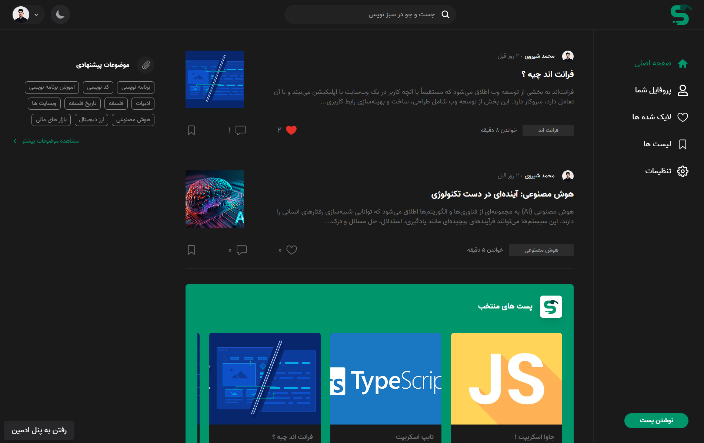
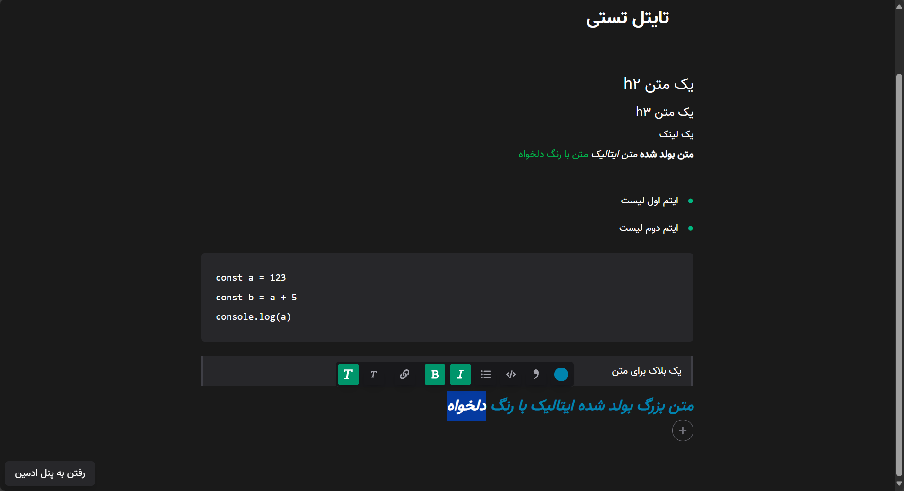
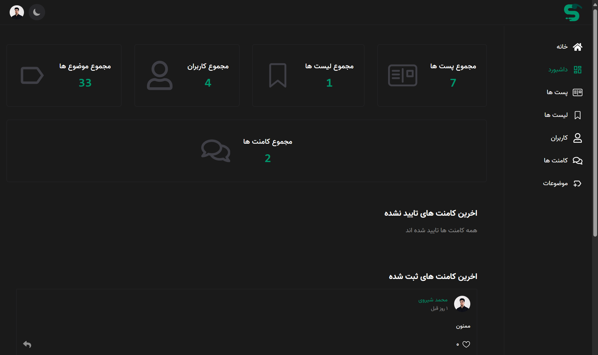

<h1 align="center">
  <br>
  <a href="https://github.com/Mohamadshiravi/set-coffee.git"></a>
</h1>

<h4 align="center">A full-Stack Website for Write and read blog with tiptap textEditor</h4>

<p align="center">
  <a href="http://nextjs.org">
    
    
    
    
  </a>
</p>

<br/>

### Features:

- **Advanced text editor powered by Tiptap with image upload support**
- **User authentication via SMS using Faraz SMS panel**
- **All uploaded images are stored in ImageKit cloud storage**
- **Profile picture upload functionality**
- **Advanced blogging system with real-time content saving to prevent data loss, even after refreshing or closing the page**
- **Follow/Unfollow system for users**
- **Dedicated user profile pages with customizable settings (profile picture, about me, etc.)**
- **Well-optimized Dark Mode for better user experience**
- **Post liking feature**
- **Ability to create and manage private or public lists and save posts in lists**
- **Advanced search system covering users, posts, lists, and topics**
- **Comprehensive comment system with support for replies and likes**
- **Full-featured admin panel with user banning, comment moderation, and more**

<h2 align="center">
  <a href="https://github.com/Mohamadshiravi/set-coffee.git"></a>
</h2>

Live on [https://sabznevis.vercel.app](https://sabznevis.vercel.app)
<br />
admin panel [https://sabznevis.vercel.app/p-admin](https://sabznevis.vercel.app/p-admin)

### Admin Panel : (login with this phone):

```bash
phone : 09011468142
```

<h2 align="center">
  <a href="https://github.com/Mohamadshiravi/set-coffee.git"></a>
</h2>

## Run Project on local

**Note:**

> !!! You need MongoDB for Run Project
> !!! You need faraz Sms Panel to Authentication with sms
> !!! You need ImageKit account and storage for upload on cloud

add This environment variables to run project :

```bash
PRIVATE_KEY : randomString
MONGODB_URI : your mongodb connection string

SMS_PANEL_PASS : 'your faraz SmS account password
SMS_PANEL_USERNAME : 'your faraz SmS account username
SMS_PANEL_PATTERN : 'your faraz SmS pattern

NEXT_PUBLIC_PUBLIC_KEY= 'get it form Imagekit'
CLOUD_PRIVATE_KEY='get it form Imagekit'
NEXT_PUBLIC_URL_ENDPOINT='get it form Imagekit'

```

And, You Need build Project By :

```bash
npm run build
# or
yarn build
# or
pnpm build
```

Next Run with :

```bash
npm run start
# or
yarn start
# or
pnpm start
```

Open [http://localhost:3000](http://localhost:3000) with your browser to see the project
